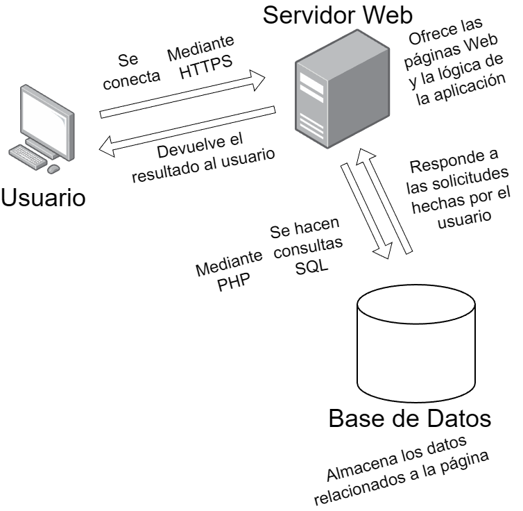

# Arquitectura

## Diagrama

## Explicación técnica
En este caso, la arquitectura se basa en **cliente-servidor**, en la que el servidor pide solicitudes al servidor, el servidor web las procesa, hace la lógica necesaria y realiza la consulta SQL que sea necesaria, y finalmente devuelve al usuario lo que ha solicitado.

## Tecnologías
Para hacer la aplicación se han utlizado las siguientes tecnologías en distintas capas:

| Capa que se usan | Tecnología usada |
| --- | --- |
| **_Frontend_** - **Lado del cliente** | HTML, CSS y JavaScript |
| **_Backend_** - **Lado del servidor**| PHP, PHPMyAdmin |
| **Sistema de bases de datos** | MySQL |
| **Sistema de control de versiones** | Git y GitHub |

Además, se ha utilizado:
- **_MarkDown_ (.md)** para realizar la documentación.
- **_GitHub Pages_** para publicar la documentación del proyecto.